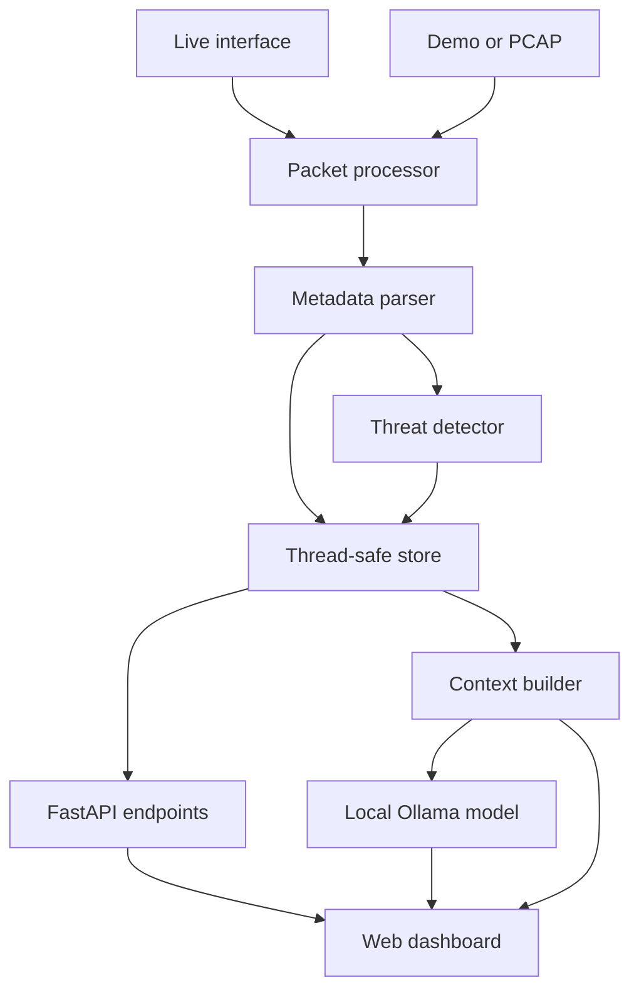

# NetSentry AI architecture

## Data flow

## Design decisions

### Metadata instead of payloads

The parser extracts timestamp, endpoints, ports, protocol, length, direction, selected transport flags and DNS query names. Application payloads are not retained. This reduces privacy risk and keeps the project focused on traffic patterns.

### Explainable detection

Each detector uses explicit thresholds and a sliding time window. An alert contains a description, evidence values and a recommended defensive response. This makes results suitable for learning, demonstrations and report discussion.

### Context-aware local AI

The browser sends the last 12 user/assistant messages with each question. The backend adds the live capture status, aggregate statistics, the selected alert, up to 20 recent alerts and up to 30 recent packet-metadata records. These are sent to the local Ollama `/api/chat` endpoint; no packet payloads are stored or sent.

Captured metadata is treated as untrusted data in the model's system prompt so that text inside a DNS name or packet field cannot become an instruction. The model is told to separate observed facts from general guidance, preserve uncertainty and avoid claiming that a detector alert proves an attack.

When Ollama is unavailable, the advisor answers from limited rule-specific templates. The UI explicitly labels this as `Rule fallback` and exposes whether Ollama is offline or the configured model is missing. Monitoring and detection therefore remain independent of the language model without presenting templates as AI-generated analysis.

### Local-only default

The server binds to `127.0.0.1` by default. Live capture is deliberately separate from the browser process, and the browser receives sanitised JSON metadata through the local API.

## Detection matrix

| Indicator | Evidence | Default window | Severity |
| --- | --- | ---: | --- |
| TCP port scan | 18 SYN packets and 10 unique destination/port pairs | 10 s | High |
| SYN flood | 35 SYN packets to one destination | 5 s | Critical |
| ICMP flood | 40 ICMP packets from one source | 5 s | High |
| DNS tunnelling indicator | long label/query plus character entropy ≥ 3.5 | Per query | Medium |
| ARP spoofing indicator | one IP advertised by a different MAC | Stateful | Critical |
| Risky service | destination port 23, 2323, 4444, 5555 or 31337 | Per flow | Low |

These thresholds are demonstration defaults. A production deployment would require baselining, per-network tuning and correlation with other telemetry.
